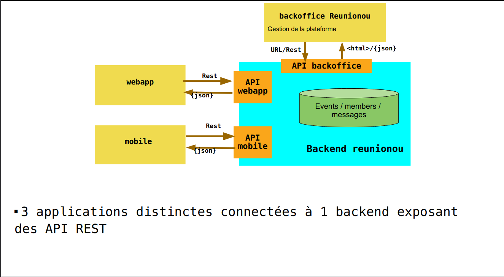

# Atelier n°2 - Reunionou

## First Architecture

## Modified Architecture

- Database : MySQL + PhpMyAdmin
- Backoffice : Slim with Server-side rendering
- Backend : Slim
- Web app : Vue.js
- Mobile app : Flutter

# API end-points

## Events/Messages Service

### Client

- /signin/ : **POST** (gateway)
- /events/{id} : **GET** - **POST** - **PUT** - **DELETE**
- /events/ : **GET**
- /events/{id}/messages : **GET**
- /messages/{id} : **PUT** - **POST** - **DELETE**
- /events/{id}/members : **GET**
- /members/{id}/ : **PUT** (gateway)

### Backoffice

- All routes in Client
- /messages/{id} : **GET**
- /users/{id} : **GET** - **POST** - **PUT** - **DELETE**
- /users/ : **GET**

## Auth Users Service

- /create/ : **POST**
- /auth/ : **POST**
- /check/ : **GET**
