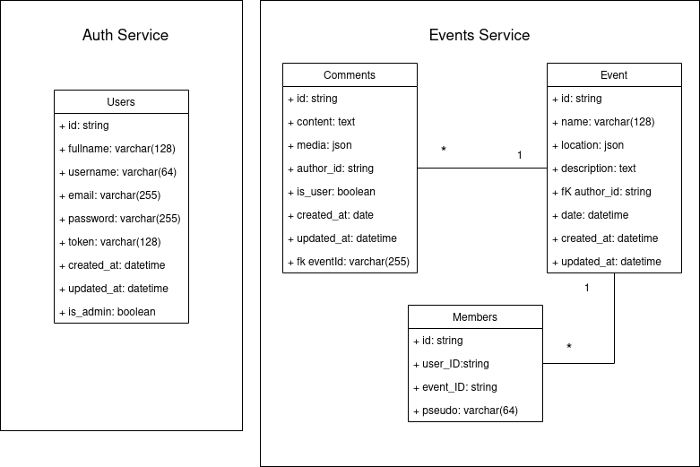

# Atelier n°2 - Reunionou
 Project made by Sébastien Klaus, Malek Ben Khalifa, Youssef Bahi & Maxime Piscaglia

# Summary
- [Architecture](#architecture)
- [API end-points](#api-end-points)
  - [Events/Messages Service](#eventsmessages-service)
    - [Client](#client)
    - [Backoffice](#backoffice)
  - [Auth Users Service](#auth-users-service)

***

# Architecture

- Database : MySQL + PhpMyAdmin
- Backoffice : Slim with Server-side rendering
- Backend : Slim
- Web app : Vue.js
- Mobile app : Flutter

***

# API end-points

## Events/Messages Service

### Client

<!-- - /signin/ : **POST** (gateway) -->
- /events/{id} : **GET** - **PUT**
- /events/ : **GET** - **POST** 
- /events/{id}/messages : **GET**
- /messages/{id} : **GET**
- /events/{id}/members : **GET**
- /members/{id}/ : **GET** (gateway)

### Backoffice

- All routes in Client
- /messages/{id} : **GET**
- /users/{id} : **GET** - **POST** - **PUT** - **DELETE**
- /users/ : **GET**

***

## Auth Users Service

- /create/ : **POST**
- /auth/ : **POST**
- /check/ : **GET**
- /update/{id} : **PUT**
- /users/{id} : **GET**